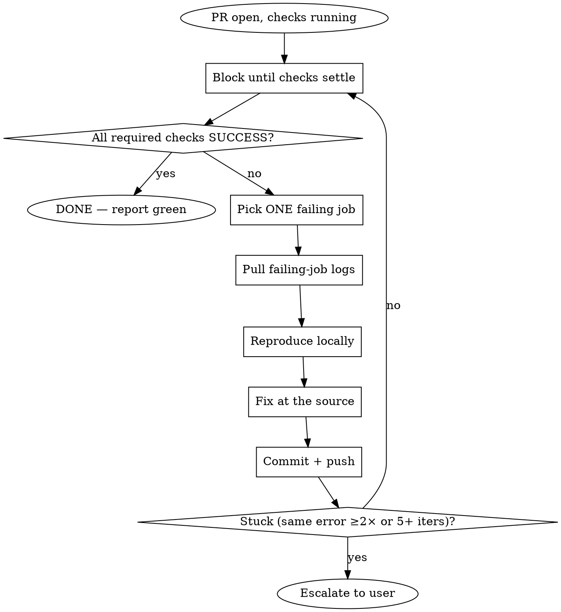

# Watch CI Gates to Green

## Overview

Run a tight **observe → diagnose → fix → push → re-watch** loop until every required check on the branch's PR passes. One failing job at a time. Never declare green without a confirming `gh pr checks` summary.

## When to Use

- A PR is open (or about to be) and must pass CI before merge.
- You've pushed a branch and been asked to "get CI green," "make checks pass," or "fix the build."

**Not for:** one-off log inspection (use `debug-github-action`), running local validation only (use `validate`), or opening the PR itself (use `create-pull-request`).

## The Loop



## Each Iteration

### 1. Observe
```bash
gh pr checks --watch   # blocks until the run settles; non-zero exit = failure
gh pr checks           # final status table — trust its summary line
```
Need the PR number for the current branch? `gh pr view --json number --jq .number`.

### 2. Diagnose (one failing job)
Follow **`debug-github-action`**: find the run → list jobs → pull the failing job's logs → grep for the real error. Read the actual failure; don't guess from the job name.

### 3. Reproduce locally
Run **`validate`** locally (compile, lint, type-check, tests) against the suite that failed in CI. A failure you can't reproduce locally is usually a flake or an environment mismatch — note it, don't blind-fix.

### 4. Fix at the source
Fix the real cause. Never disable a test, special-case an input, or widen a guard just to flip a check green. Re-run the local check that mirrors the failing CI job until it passes.

### 5. Push
Stage and commit with **`commit`**, then `git push`. The push triggers a new run — return to step 1.

## Exit Conditions

- **GREEN (stop, report):** `gh pr checks` prints "All checks were successful" AND no required check is still pending. Report which checks passed.
- **ESCALATE (stop, ask):** the same job fails with the same root error twice in a row, or you've done 5+ iterations without convergence — you're likely fighting a flake, an infra issue, or a constraint that needs a human decision. Report exactly what you tried and what's blocking.

## Hard Rules

- **MUST use `gh`** for all GitHub interaction (per `github-cli`). No `curl`, no browser.
- **NEVER declare green** from a local run alone — CI is the source of truth.
- **NEVER merge** unless explicitly asked; this skill only reaches green.
- **One job per iteration.** Fixing five things blind before pushing wastes a cycle if job #3 was the real cause.
- **Push before re-watching.** A local pass doesn't update CI; only a push does.

## Required Sub-Skills

- **`debug-github-action`** — pulling run/job logs and grepping failures.
- **`validate`** — the local check suite that mirrors CI.
- **`commit`** — staging, committing, and pushing fixes.
- **`github-cli`** — `gh` is the only GitHub interface.
